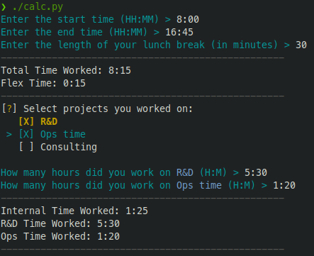

# workhours-calculator
Simple python script to calculate worked hours in a day, because I'm too lazy to do simple math at the end of a workday.

## Example


## How it works

Install requirements:
```
pip install -r requirements.txt
```

Simply run:
```
./calc.py
```

*Use arrowkeys on keyboard to select projects and press enter to confirm.*

## Changing/adjusting projects

You can change the name of projects by setting the variables `project_one`, `project_two`, and `project_three` at the beginning of calc.py.

**To add or remove projects you need to:**

1. Create or remove a project variable at the beginning of calc.py
2. Add or remove the variable from the inquirer choices list
3. Adjust all "for loops" that loop through selected projects
